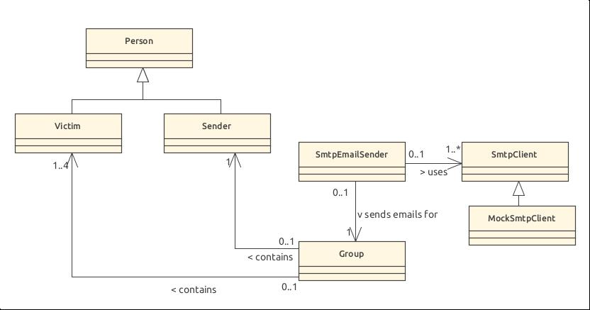

# dai-lab-smtp

This program automatically sends premade emails to multiple groups of people. Given a .txt file with a list of emails, a .json file with the subjects and bodies of the emails and a number of groups, this program will form groups of 2-5 people selected from the list of emails and assign a message to each group. The first person selected in each group will be the 'sender' and an email is sent to everyone else in the group that will be seen as if it was sent from the designated sender.

## File formats

The .txt file containing the list of emails is simply formatted with one email per line

```
example1@domain1.com
example2@domain2.com
example3@domain3.com
```

The .json is formatted like this:

```json
[
  { "subject": "subject1", "body": "message1" },
  { "subject": "subject2", "body": "message2" }
]
```

Files are read through static functions from a FileReader class and .json is parsed using the Gson library.

## Implementation



### Group Class

Emails are sent by group and each Group object contains all the information necessary to send an email.

Group object are constructed with a sender, a list of victims and a message. The amount of people per group (2 minimum and 5 maximum) is determined by the amount of groups asked for and the amount of emails provided.

All groups will try to have as many people as possible while keeping the same amount in every group with no overlap.

Messages are assigned to each group in their order
in the .json file (if there are too few messages, we go back to the start of the list to assign them).

Any remaining email addresses that can't be fit in groups are ignored.

### Smtp Handlers

Once a group is made an SmtpEmailSender is constructed for each group, which handles connecting to the smtp server and sending all the emails for their group. For each distinct domain in the list of victims, we connect to the (simulated) corresponding domain's smtp server. (NOTE: as this application is not supposed to send e-mails to real people, we don't really dig dns (see what we did there? ;) ) for the actual server domain information).

The SmtpClient class handles the dialogue with the server

### Mock-up server and MockSmtpClient

To avoid sending prank e-mails to real addresses, a mock-up server is used.

The mock-up server can be started using docker with the following command:

```
docker run -d -p 1080:1080 -p 1025:1025 maildev/maildev
```

By default, the MockSmtpClient class constructor, connects to this server.

### Exceptions

An exception is thrown in the following cases:

1. there's not enough e-mail addresses
2. an erroneous address is detected in the file.
3. if the smtp server responds with an error.

## Building

The application uses maven as a build tool and java21.

To build (make sure the mock server is running as it is used during testing) and then simply:

```
cd dai-smpt
mvn package
```
